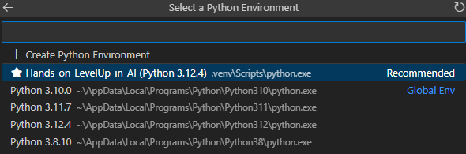

# Setup Instructions for Python

Congratulations on taking this amazing step to level up your skills! Get ready for an exciting Python and AI learning journey ahead! You've got this! 🚀

This guide will help you set up your development environment for the Python and AI weekly learning content. Follow these steps to install and configure all necessary tools.

## 1. Installing Visual Studio Code (Optional, if haven't installed VS code)

VS Code is a lightweight but powerful source code editor that runs on your desktop.

### Windows
1. Visit the [VS Code download page](https://code.visualstudio.com/download)
2. Click on the Windows download button
3. Run the installer (.exe file) that you downloaded
4. Follow the installation wizard (use default settings)
5. Launch VS Code after installation

### macOS
1. Visit the [VS Code download page](https://code.visualstudio.com/download)
2. Click on the macOS download button
3. Open the downloaded .zip file
4. Drag Visual Studio Code.app to the Applications folder
5. Launch VS Code from your Applications folder

### Linux
1. Visit the [VS Code download page](https://code.visualstudio.com/download)
2. Download the appropriate package for your distribution
3. Install using your package manager:
   - Debian/Ubuntu: `sudo apt install ./downloaded-package.deb`
   - RHEL/Fedora/CentOS: `sudo rpm -i downloaded-package.rpm`
4. Launch VS Code from your applications menu or terminal

## 2. Installing Python

### Windows
1. Visit the [Python downloads page](https://www.python.org/downloads/)
2. Click on "Download Python" (choose the latest stable version, 3.12.6)
3. Run the installer
4. **Important**: Check the box that says "Add Python to PATH"
5. Click "Install Now"
6. Open Command Prompt to verify installation:
   - Press `Win + R`, type `cmd` and press Enter
   - Or search for "Command Prompt" in the Start menu
   - Then type:
   ```
   python --version
   ```

### macOS
1. Open Terminal:
   - Press `Cmd + Space`, type "Terminal" and press Enter
   
2. Install Homebrew if you don't have it:
   ```
   /bin/bash -c "$(curl -fsSL https://raw.githubusercontent.com/Homebrew/install/HEAD/install.sh)"
   ```
3. In the same Terminal, install Python using Homebrew:
   ```
   brew install python
   ```
4. Still in Terminal, verify installation by typing:
   ```
   python3 --version
   ```

### Linux
1. Open Terminal:
   - Press `Ctrl + Alt + T` or search for "Terminal" in your applications

2. Most Linux distributions come with Python pre-installed
3. If not, install it using your package manager in the Terminal:
   - Debian/Ubuntu: 
     ```
     sudo apt update && sudo apt install python3 python3-pip
     ```
   - RHEL/Fedora/CentOS: 
     ```
     sudo dnf install python3 python3-pip
     ```
4. Still in Terminal, verify installation by typing:
   ```
   python3 --version
   ```

## 3. Installing Required VS Code Extensions

VS Code extensions are add-ons that enhance the editor's functionality for specific programming languages, frameworks, and tools. They provide features like syntax highlighting, code completion, debugging capabilities, and specialized tools that make development easier and more efficient. Extensions allow you to customize VS Code to create an ideal environment for your specific programming needs.

For our Python and AI learning path, we'll need several key extensions that will provide essential Python development features:

1. Open VS Code
2. Open the Extensions view by clicking on the Extensions icon in the Activity Bar on the side of the window or pressing `Ctrl+Shift+X` (Windows/Linux) or `Cmd+Shift+X` (macOS)
3. Search for and install the following extensions:
   - **Python** (by Microsoft) - Provides Python language support, debugging, and Jupyter notebook integration
   - **Jupyter** (by Microsoft) - Allows you to create and run Jupyter notebooks directly within VS Code
   - **Pylance** (by Microsoft) - Offers advanced Python language features like type checking and intelligent code completion

## 4. Installing and Using UV for Package Management

UV is a modern Python package manager that's significantly faster than pip. It provides improved dependency resolution and installation speed.

### Installing UV

#### Windows
1. Open Command Prompt or PowerShell:
   - Press `Win + X` and select "Windows PowerShell" or "Command Prompt"
   - Or search for "cmd" or "powershell" in the Start menu

```powershell
# Install UV using pip
pip install uv
# Verify installation
uv --version
```

#### macOS/Linux
1. Open Terminal:
   - macOS: Press `Cmd + Space`, type "Terminal" and press Enter
   - Linux: Press `Ctrl + Alt + T` or search for "Terminal" in your applications

```bash
# Install UV using pip
pip install uv

# Verify installation
uv --version
```
**Note**: After installing UV globally, you can use it for any Python project on your system.

## 5. Understanding Virtual Environments

A virtual environment isolates your project dependencies from your system Python. You can use either the traditional venv approach or UV's built-in virtual environment management.

**Note**: The following instructions are general guidelines to help you learn how to create virtual environments.

### Using UV's virtual environment management (after installing UV)

#### Windows
1. Open Command Prompt or PowerShell:
   - Press `Win + X` and select "Windows PowerShell" or "Command Prompt"
   - Or search for "cmd" or "powershell" in the Start menu

```bash
# Navigate to your project folder
cd path\to\your\project

# Create a virtual environment with UV
uv venv

# Optional: Specify a Python version 
# uv venv --python C:\Python312\python.exe

# Activate the virtual environment
.venv\Scripts\activate
```

#### macOS/Linux
1. Open Terminal:
   - macOS: Press `Cmd + Space`, type "Terminal" and press Enter
   - Linux: Press `Ctrl + Alt + T` or search for "Terminal" in your applications

```bash
# Navigate to your project folder
cd path/to/your/project

# Create a virtual environment with UV
uv venv

# Optional: Specify a Python version
# uv venv --python python3.12
# Or with full path: uv venv --python /usr/bin/python3.12

# Activate the virtual environment
source .venv/bin/activate
```

# Repository/Project Specific Setup

## 1. Cloning the Learning Content Repository

- repository-url - https://github.com/solitontech/SPL-7.git
- repository name - SPL-7


1. Open a terminal:
   - **Windows**: Open Command Prompt or PowerShell
   - **macOS/Linux**: Open Terminal

2. Run the following commands:

Replace `[repository-url]` with the actual URL and `[repository-name]` with the actual name of the provided repository provided above.

```bash
# Clone the repository
git clone [repository-url]

# Navigate to the repository folder
cd [repository-name]

# Create a virtual environment with UV
uv venv

# Activate the virtual environment
# On Windows:
.venv\Scripts\activate
# On macOS/Linux:
# source .venv/bin/activate

# Install the packages from the pyproject.toml
uv pip install -e .

# To add custom packages (optional)
uv add <package_name>
```

**Note**: You should see your terminal prompt change to indicate that the virtual environment is active. It will typically show `(.venv)` at the beginning of the prompt line.

### Essential Git Commands

Here are the key Git commands you'll use most frequently. Run these in your terminal while inside the repository folder:

1. **git pull**: Update your local repository with the latest learning materials and examples. This is the command you'll use most often to get new content.
   ```bash
   # Make sure you're in the repository directory
   cd [repository-name]
   
   # Pull the latest changes
   git pull
   ```

2. **git status**: Check if your local repository is up-to-date or if there are new changes available.
   ```bash
   # Open terminal in the repository folder
   git status
   ```

3. **git add**: Stage changes before committing them. This marks which changes you want to include in your next commit.
   ```bash
   # Add a specific file
   git add filename.py
   
   # Add multiple specific files
   git add file1.py file2.py
   
   # Add all files of a specific type
   git add *.py
   
   # Add all changes in the current directory
   git add .
   
   # Add changes interactively (review each change)
   git add -p
   ```

4. **git commit**: Save your changes with a descriptive message. This is essential when you make modifications to the code.
   ```bash
   # Commit the changes you've staged with git add
   git commit -m "Brief description of what you changed"
   
   # Combine add and commit for already tracked files
   git commit -am "Updated existing files"
   ```

5. **git log**: View the history of updates to the learning materials.
   ```bash
   # Open terminal in the repository folder
   # View recent commits
   git log --oneline -n 5
   ```

6. **git checkout**: Switch to specific versions of learning materials or examples if needed.
   ```bash
   # Open terminal in the repository folder
   # Checkout a specific file from the repository
   git checkout origin/main -- path/to/file.py
   ```

7. **VS Code Git GUI**: You can perform many Git operations directly through VS Code's graphical interface without typing commands:
   - View changes in the Source Control tab (icon on the left sidebar)
   - Stage changes by clicking the + icon next to modified files
   - Commit by typing a message and clicking the checkmark icon
   - See diffs by clicking on modified files
   - Pull, push, and manage branches from the three-dot menu (⋯)
   - View file history by right-clicking a file and selecting "Git: View File History"

## 2. Running Jupyter Notebooks in VS Code

1. Open VS Code
2. Open the project folder: `File > Open Folder` and select the cloned repository folder
3. Navigate to the `week1` folder in the Explorer view
4. Open `week1_python_basics.ipynb`
5. In the top right corner, click on `Select Kernel` to select the Python interpreter from your virtual environment:

   

6. You can now run cells by clicking the play button to the left of each cell or by pressing `Shift+Enter`

## Troubleshooting

### Python not found
- Make sure Python is added to your PATH
- Try using `python3` instead of `python` on macOS/Linux
- Open a terminal and verify with `python --version` or `python3 --version`

### Jupyter not working
- Make sure you've installed the Jupyter extension for VS Code
- Open a terminal in your project directory with the virtual environment activated and run:
  ```bash
  uv pip install --upgrade jupyter
  ```

### Package installation errors
- Make sure your virtual environment is activated (you should see `(.venv)` in your terminal prompt)
- Open a terminal in your project directory and run:
  ```bash
  # Install a specific package
  uv pip install <package-name>
  
  # List installed packages to verify
  pip list
  ```
- If UV is having issues, try reinstalling it from your terminal
- On Windows, you might need Visual C++ build tools for some packages: [Microsoft C++ Build Tools](https://visualstudio.microsoft.com/visual-cpp-build-tools/)

### UV specific issues
- If UV commands aren't found, open a new terminal and ensure it's properly installed in your PATH
- For dependency conflicts, open a terminal and run:
  ```bash
  uv pip install --resolution=highest <package-name>
  ```

## Additional Resources

### Tools in Data Science Course

If you're interested in learning more about using VS Code, Python, and other tools for data science, check out this free course:

- [Tools in Data Science](https://www.s-anand.net/blog/tools-in-data-science-course-is-free-for-all/)
- [Course GitHub Repository](https://github.com/sanand0/tools-in-data-science-public/tree/main)

This course includes helpful video tutorials on using VS Code, Python, and various data science tools. It's a great supplement to this learning path and provides additional hands-on guidance for setting up and working with your development environment.

## Need Help?

If you encounter any issues during setup, please contact your team coordinator for assistance.

Happy coding!